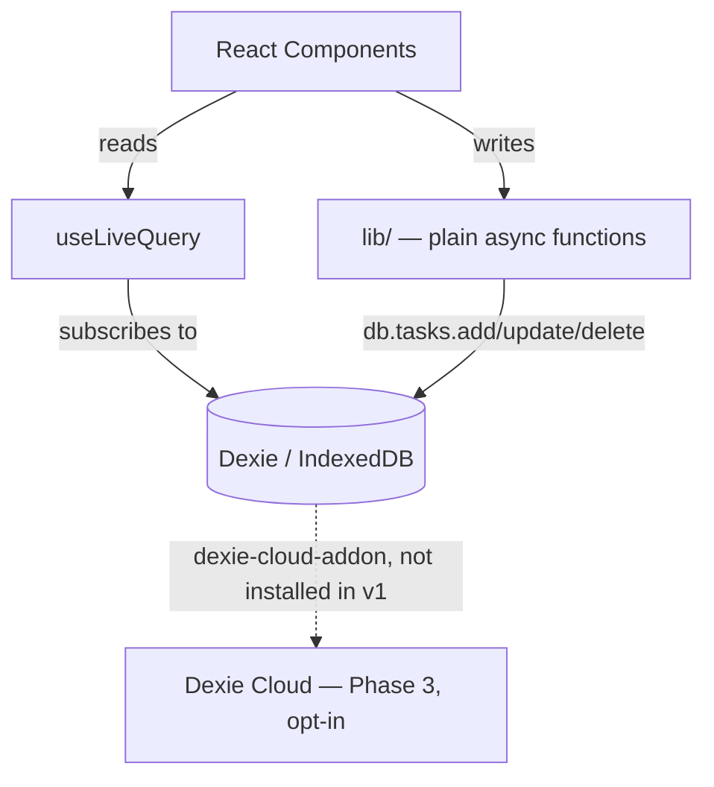

# How Long Since — Architecture

> **Confirmed June 2026, revised 2026-07-07 to describe the app as built
> (1.0.0).** This document merges the original planning trio (`tech.md`,
> `design.md`, `structure.md`); the frozen pre-implementation versions live in
> git history under `dev/2026-07-01_phase1-mvp/docs/architecture/`. The stack
> was locked after evaluating two Next.js-based alternatives, and won on two
> grounds: it's the right tool for a client-only app with no server in v1, and
> Dexie Cloud gives the roadmap's Phase 3 (cloud sync + shared households) a
> real, low-effort implementation path — see the last section.
>
> Commands, ports, and day-to-day workflows live in
> [`DEVELOPER_GUIDE.md`](DEVELOPER_GUIDE.md), not here.

## Overview

A mobile-first, accessibility-compliant task tracker that answers "how long
has it been since...?" rather than managing due dates, built local-first so it
works fully offline with no account required to start. This document covers
the as-built Vite + Dexie implementation of that product.

## Technology Stack

- **Vite 6** + **React 19** with TypeScript (strict) — no Next.js. The app is
  100% client-side with no account in v1; Next.js's headline features (SSR,
  RSC, Server Actions) need a server this app doesn't have. Vite is the
  purpose-built toolchain for a client-only PWA.
- **TanStack Router** — file-based, type-safe client routing across the app's
  six routes (see the structure section below). Route trees are generated
  (`src/routeTree.gen.ts`) with automatic code-splitting.
- **Tailwind CSS v4** — CSS-first `@theme` tokens declared directly in
  `src/styles/globals.css` (hex values; the Soft Daylight palette per
  [`STYLE_GUIDE.md`](STYLE_GUIDE.md) §1), no `tailwind.config.js`;
  `tw-animate-css` for animations.
- **shadcn/ui** — components are copied into the repo (`src/components/ui/`),
  not installed as a dependency: no library upgrade path to manage, full
  ownership of every file, re-tokenized to Soft Daylight.
- **Dexie.js** — wraps IndexedDB, eliminating raw `indexedDB.open()`/
  transaction boilerplate.
- **`dexie-react-hooks`** (`useLiveQuery`) — components subscribe directly to
  live Dexie queries, so there's no custom `useTasks` hook or service-class
  CRUD wrapper to write and maintain.
- **`dexie-cloud-addon`** (Phase 3 only, **not installed** in v1) — official
  Dexie addon adding accounts, multi-device sync, and shared "realms"; the
  concrete implementation path for Phase 3. See "Turning on sync" below.
- **Backup/restore** — hand-rolled, not an addon: a Zod-validated JSON
  envelope (`src/lib/export-import.ts`) is the backup and *only* restore path,
  plus a tasks-only CSV export via PapaParse (`src/lib/csv-export.ts`).
  (`dexie-export-import` was considered in planning and not used.)
- **Zustand** — transient UI-only state (modal open, undo snackbar). Task and
  category *data* stays in Dexie via `useLiveQuery` as the single source of
  truth — Zustand never holds app data.
- **Zod v4** — runtime validation; schemas are also the source of the TS types
  (`z.infer`). Top-level validators (`z.uuid()`, not `z.string().uuid()`).
- **react-hook-form** — form state for the task and category forms.
- **`vite-plugin-pwa`** — manifest, Workbox service worker, auto-update.
- **Vitest** + **React Testing Library** + **vitest-axe**; **Playwright** for
  end-to-end tests.
- **ESLint** + **Prettier**; **pnpm**.

## Architecture Patterns

- **Local-first** — IndexedDB (via Dexie) is the source of truth; no network
  call is ever on the critical path for reads or writes in v1.
- **Reactive queries over a service layer** — `useLiveQuery` reads directly
  from Dexie; plain async functions (not classes, not `APIResponse<T>`
  envelopes) handle writes and business logic.
- **Config-flag cloud, not a rewrite** — Dexie Cloud is designed to be added
  to an existing Dexie schema without changing how components query data.
- **Accessibility-first** — WCAG AA built on shadcn/Radix primitives.



There's no separate "service layer" or "database abstraction layer." Dexie's
table API already *is* the data-access layer — no raw IndexedDB calls to
wrap — and `useLiveQuery` already *is* the reactive query layer, so there's no
custom `useTasks` hook needed to re-derive what Dexie gives for free. What's
left to write by hand is genuinely business logic: validation, overdue
calculation, import/export — plain functions in `lib/`, not classes wrapping
every call in a `Promise<APIResponse<T>>` envelope. That kind of envelope
exists to mimic a future REST API; without a REST API to mirror — because
Dexie Cloud, not a hand-built backend, is the Phase 3 path — there's nothing
for it to prepare for.

## Core Data Models

As defined in `AGENTS.md` (the canonical copy). The Zod schemas in
`src/schemas/` are the runtime source of these types via `z.infer`.

```typescript
interface Task {
  id: string;
  name: string;                    // 128 char max
  description: string;             // 512 char max
  categoryId: string;
  createdAt: Date;
  lastCompletedAt: Date | null;
  expectedFrequency?: { value: number; unit: 'day' | 'week' | 'month' | 'year' };
  timeCommitment?: '15min' | '30min' | '1hr' | '2hrs' | '4hrs+';
  isArchived: boolean;
  notes: string;                   // 512 char max
  instanceLabel?: string;          // Phase 1.1 — "where or who" (40 char max, trimmed)
  seriesId?: string;               // Phase 1.1 — shared by tasks fanned out together; system-owned
}

interface Category {
  id: string;
  name: string;
  color?: string;
  icon?: string;
  isDefault: boolean;
}

interface Completion {
  id: string;
  taskId: string;
  completedAt: Date;   // one row per "Just Done" (bursts included) + bootstrap rows
}

interface AppSettings {
  id: string;                      // singleton row, always '1'
  lastBackupDate: Date | null;
  currentView: 'quick' | 'category' | 'time';  // default 'quick' (Quick Wins)
  theme: 'light' | 'dark' | 'system';
  textSize: 'default' | 'large' | 'larger';
  highContrast: boolean;
  reducedMotion: boolean;
}
```

**Instances & series (Phase 1.1):** tasks stay independent rows; siblings
sharing a `seriesId` collapse into an expandable group row in By Category and
By Time (never in Quick Wins, where siblings rank independently). The two
fields are deliberately **un-indexed** and added **without a schema version
bump** — Dexie stores undeclared fields fine, grouping runs in memory
(`src/lib/series.ts`), and keeping both fields optional in Zod means pre-1.1
backups import unchanged. Decisions register:
`dev/2026-07-03_grouped-tasks/phase1.1.md`.

## Dexie Schema & Versioning

`src/lib/db/schema.ts` — database `HowLongSinceDB`, four stores, currently
**version 3**:

```typescript
this.version(1).stores({
  tasks: 'id, categoryId, lastCompletedAt, isArchived',
  categories: 'id, isDefault',
  settings: 'id',
});

// v2: the timeCommitment enum dropped '5hrs+' and renamed '4hrs' → '4hrs+'
// (one open-ended "Big projects" bucket). Indexes unchanged; the upgrade
// rewrites any orphaned value on existing rows.
this.version(2).stores({ /* same indexes */ }).upgrade(/* … */);

// v3 (shipped inside 1.0.0): the silent, append-only `completions` log —
// Phase 2 B6 groundwork pulled forward, because history can't be backfilled
// after the fact. The upgrade synthesizes one bootstrap row per
// already-completed task; taskId/completedAt are indexed now so the future
// history UI won't need another bump.
this.version(3)
  .stores({ /* + */ completions: 'id, taskId, completedAt' })
  .upgrade(/* bulkAdd(synthesizeCompletions(tasks)) */);
```

> **Boolean-index trap:** `isArchived` appears in the index list, but
> IndexedDB **cannot index booleans** — `where('isArchived')` silently returns
> nothing. All views read the table and filter archived tasks **in memory**
> (see `src/components/task/TaskList.tsx`). Keep doing that (or migrate the
> field to 0/1) rather than reintroducing a `where` on it.

**Seeding — two distinct paths** (`src/lib/db/`):

- `seedDatabase()` (schema.ts) runs on every boot and is idempotent: inserts
  the 10 `DEFAULT_CATEGORIES` (fixed UUIDs, colors per `STYLE_GUIDE.md` §1.4,
  Lucide icon names) only when the categories table is empty, and the
  `DEFAULT_SETTINGS` singleton (`id: '1'`) only if absent. It never clobbers
  user edits.
- `seedSampleTasks()` (dev-seed.ts) is **DEV-only** (`import.meta.env.DEV`)
  and no-ops when any task exists: 15 sample tasks spanning every overdue
  tier, including a three-task "Vacuum bedroom" series. It never runs in
  preview, e2e, or production builds.

**Backup envelope** (`src/lib/export-import.ts`):
`{ app: 'how-long-since', schemaVersion: 3, exportedAt, data: { tasks,
categories, settings, completions } }`, revived and validated with Zod
(`z.coerce.date()` for ISO strings). Import is a full **replace** and JSON is
the only import format. Older envelopes import forever (the validator never
range-compares `schemaVersion`); a backup with **no** `completions` key gets
one bootstrap row synthesized per completed task, while an explicit `[]` is
trusted as-is.

## Business Logic — Plain Functions, Not Service Classes

`src/lib/tasks.ts` (shape as shipped):

```typescript
export async function createTask(input: unknown): Promise<Task>;            // Zod-parses, stamps id/createdAt
export async function createTaskSeries(baseInput: unknown, labels: string[]): Promise<Task[]>; // Phase 1.1 fan-out
export async function updateTask(id: string, patch: unknown): Promise<void>;
export async function markTaskComplete(id: string): Promise<CompleteResult>; // { previous, completionId } — the undo contract
export async function undoComplete(id: string, previous: Date | null, completionIds?: string[]): Promise<void>;
export async function archiveTask(id: string): Promise<void>;
export async function unarchiveTask(id: string): Promise<void>;             // no UI calls this yet (restore = backup import)
export async function deleteTask(id: string): Promise<void>;
```

`markTaskComplete` stamps the task, appends a row to the `completions` log
(v3 — silent Phase 2 B6 groundwork), and returns `{ previous, completionId }`.
That is what makes the 5-second Undo exact: the toast's Undo button calls
`undoComplete(id, previous, completionIds)`, restoring even a `null`
(never-completed) state and deleting every log row the tap burst appended —
an undo that restored the date but left rows behind would silently corrupt
history.

Errors are real thrown `Error`/`ZodError` objects, not a hand-formatted
`{ status: 'error', message }` envelope — React error boundaries and a thin
try/catch at the call site handle them, the same as any other async call in a
client-only app with no API boundary to normalize across.

### Overdue Status — Three Tiers

[`REQUIREMENTS.md`](REQUIREMENTS.md) Req 2.6–2.9 defines three tiers based on
percentage of the expected interval elapsed since `lastCompletedAt` (canonical
thresholds in `AGENTS.md`). A task with no `expectedFrequency`, or with
`expectedFrequency` but no `lastCompletedAt` yet, is never overdue:

```typescript
// src/lib/overdue.ts
export function calculateOverdueStatus(task: Task, now = new Date()): OverdueStatus {
  if (!task.expectedFrequency || !task.lastCompletedAt) return 'none';

  const intervalMs = task.expectedFrequency.value * UNIT_MS[task.expectedFrequency.unit];
  const pctElapsed = (now.getTime() - task.lastCompletedAt.getTime()) / intervalMs;

  if (pctElapsed < 0.8) return 'none';
  if (pctElapsed < 1) return 'due-soon';
  if (pctElapsed < 1.5) return 'overdue';
  return 'very-overdue';
}
```

A pure function, not a class method — trivially unit-testable with plain
`Task` fixtures and a fixed `now`, no Dexie or mocking involved.

### Reactive Reads — `useLiveQuery`

The shipped read pattern (note the in-memory archived filter — see the
boolean-index trap above):

```tsx
// src/components/task/TaskList.tsx (abridged)
export function TaskList({ categoryId }: TaskListProps) {
  const tasks = useLiveQuery(() => db.tasks.toArray(), []);
  const categories = useLiveQuery(() => db.categories.toArray(), []);

  if (tasks === undefined || categories === undefined) return <TaskListSkeleton />;

  const active = tasks.filter(
    (t) => !t.isArchived && (categoryId ? t.categoryId === categoryId : true),
  );
  // …render <TaskCard> per task
}
```

`tasks` is `undefined` while the first query resolves and automatically
re-renders whenever the underlying data changes — including changes made by
*other* browser tabs, and (once Phase 3 is on) changes synced in from another
device. No `loading`/`error`/`data` state to wire up by hand, no manual
`refetch()` after a mutation.

### Validation — Zod v4

`src/schemas/{task,category,settings}.ts` hold the schemas;
`src/types/index.ts` derives the TS types with `z.infer`. Note Zod v4's
top-level validators (`z.uuid()`, `z.date()`) — v3's chained
`z.string().uuid()` form is gone. `createTaskSchema` is `taskSchema.omit({...})`
for the fields the create path stamps itself. Validation happens at the `lib/`
function boundary — the one place writes occur.

### Client (UI-only) State — Zustand

`src/stores/ui-store.ts` — only state with no business in the database:
modal/drawer open flags, undo-snackbar payload, session-scoped banner
dismissals. `currentView`/`theme`/`textSize`/etc. stay in the `settings` Dexie
table (per `AppSettings` above) rather than moving to Zustand — one source of
truth for anything that should eventually travel with the user across devices
under Dexie Cloud, instead of splitting persisted state across two stores.

## Project Structure

```
├── src/                        # Application source (see below)
├── public/                     # Static assets, PWA icons, served user guide (generated)
├── docs/                       # Living documentation (this file, guides, reference docs)
├── dev/                        # Dated per-batch planning archives (plans + decision registers)
├── e2e/                        # Playwright specs (+ e2e/screenshots/ capture harness)
├── scripts/                    # Standalone build/utility scripts (user-guide generator, curly quotes)
├── server/                     # Zero-dependency Node static server for the Docker image
├── index.html                  # Vite entry; pre-paint theme guard script (source of truth)
├── vite.config.ts              # Vite + router + Tailwind + PWA config + Vitest `test` block
├── playwright.config.ts        # e2e suite  ·  playwright.screenshots.config.ts — screenshot harness
├── tsconfig.json               # Project references → tsconfig.app.json / tsconfig.node.json
├── components.json             # shadcn/ui CLI config
├── eslint.config.mjs · .prettierrc
└── Dockerfile · docker-compose.yml
```

```
src/
├── main.tsx                   # App entry: mounts router, seeds DB, providers
├── routeTree.gen.ts           # GENERATED by TanStack Router — never edit
├── routes/                    # File-based routes (each file exports only `Route`)
│   ├── __root.tsx             # Root layout (app shell, providers)
│   ├── index.tsx              # `/` — Quick Wins (default view)
│   ├── category.tsx           # `/category` — By Category view
│   ├── time.tsx               # `/time` — By Time view
│   ├── categories.tsx         # `/categories` — Manage Categories
│   ├── tasks.$taskId.tsx      # `/tasks/:id` — Edit task
│   └── settings.tsx           # `/settings`
├── components/
│   ├── ui/                    # shadcn/ui primitives (owned, Soft Daylight tokens)
│   ├── task/                  # TaskCard/TaskList/TaskForm/AddTaskDialog, views
│   │                          #   (QuickWinsView, ByTimeView), TaskSeriesGroup,
│   │                          #   InstanceLabelsField, TaskCompletionButton, …
│   ├── category/              # ByCategoryView, ManageCategories, CategoryForm, badges/icons
│   ├── layout/                # AppShell, PreferencesProvider, ViewToggle, FAB,
│   │                          #   BackupReminderBanner, RootErrorBoundary
│   └── settings/              # SettingsView + section components (Data, About, …)
├── lib/                       # Business logic — plain functions, not classes
│   ├── db/                    # schema.ts (Dexie class, versions, seed) · dev-seed.ts (DEV samples)
│   ├── tasks.ts · categories.ts · series.ts · settings.ts
│   ├── overdue.ts · time-format.ts · time-sections.ts
│   ├── category-order.ts · category-tags.ts
│   └── export-import.ts · csv-export.ts · download.ts · utils.ts
├── schemas/                   # Zod v4 schemas (source of the types)
├── stores/                    # ui-store.ts (Zustand, transient UI only)
├── types/                     # z.infer-derived types (index.ts)
├── hooks/                     # use-focus-on-mount.ts
├── styles/globals.css         # Tailwind v4 @theme tokens (Soft Daylight)
└── test/                      # Vitest setup (fake-indexeddb, RTL, vitest-axe), router helper
```

### Conventions

- **Components**: PascalCase (`TaskCard.tsx`), flat files with a co-located
  `TaskCard.test.tsx` — no per-component folders, no Storybook.
- **Routes**: TanStack file convention (`tasks.$taskId.tsx`); route files
  export **only** `Route` so automatic code-splitting stays effective —
  shared components live under `components/`, not in route files.
- **lib functions**: camelCase plural modules by domain (`tasks.ts`, not
  `TaskService.ts`) — no `Service` suffix, since there's no class to suffix.
- **Schemas**: camelCase matching domain (`task.ts`), exporting `taskSchema` /
  `createTaskSchema`. **Stores**: camelCase ending in `-store`.
- **Imports**: `@/` alias for absolute imports from `src/`; named exports
  preferred; import groups sorted by ESLint.

## Testing Approach

Unit-heavy on `lib/` (pure functions + `fake-indexeddb` giving Dexie a real
in-memory IndexedDB — no DB-abstraction class to mock, because there isn't
one), component tests with React Testing Library plus `vitest-axe`
accessibility assertions, and Playwright for true end-to-end flows
(create→complete→undo→archive, import/export round-trip, offline/service
worker, PWA installability). Unit/component tests are co-located with their
modules; `src/test/setup.ts` wires `fake-indexeddb/auto`, RTL cleanup, and the
axe matchers. Harness details, the e2e-vs-screenshots config split, and
run-order gotchas: [`DEVELOPER_GUIDE.md`](DEVELOPER_GUIDE.md).

## UI Theming & Accessibility

Design tokens, dark mode, and the WCAG AA reconciliation are specified in
[`STYLE_GUIDE.md`](STYLE_GUIDE.md) §1 and implemented as Tailwind v4 `@theme`
custom properties in `src/styles/globals.css` (light on `:root`, dark under
both the media query and `[data-theme='dark']`, plus a
`[data-high-contrast='true']` layer). Copy and tone follow
[`CONTENT_STRATEGY_GUIDE.md`](CONTENT_STRATEGY_GUIDE.md). Accessibility
commitments (4.5:1 AA text, ≥44px targets, non-color status cues, reduced
motion) are requirements — [`REQUIREMENTS.md`](REQUIREMENTS.md) Req 6 — and
ride on shadcn/Radix primitives plus the AA-safe token set; they are not
re-specified here.

## PWA / Offline

`vite-plugin-pwa` with `registerType: 'autoUpdate'` (silent updates); icons
generated from `public/favicon.svg` by `pwa-assets-generator`. Because all
data lives in IndexedDB and no network call is on the read/write path,
"offline support" means "precache the app shell" — Workbox's default, widened
to include the self-hosted `woff2` fonts. The served user guide
(`/user-guide.html` + its screenshots) is deliberately **excluded** from the
precache and the SPA `navigateFallback` (denylist), with a
StaleWhileRevalidate runtime cache instead — the guide stays reachable as a
real page, works offline after first view, and doesn't bloat installs. See
the `VitePWA` block in `vite.config.ts`.

Push notifications (overdue reminders, backup nudges) are explicitly out of
scope for v1 — the backup reminder ships as an in-app banner, and Settings now
explains plainly that reminders live in the app while phone push waits for a
later cloud phase. The [B9 research spike](../dev/2026-07-07_notifications-research/register.md)
(2026-07-07) confirmed why: push always needs a server, so it belongs in Phase 3
(see "Phase 3: Turning On Sync" below).

## Phase 3: Turning On Sync

When (and if) "Phase 3: Cloud & Community" actually gets scoped:

```bash
npm install dexie-cloud-addon
```

```typescript
// lib/db/schema.ts — the only file that changes
import dexieCloud from 'dexie-cloud-addon';

export class HowLongSinceDB extends Dexie {
  // ...same table declarations...

  constructor() {
    super('HowLongSinceDB', { addons: [dexieCloud] });

    this.version(1).stores({
      tasks: '@id, categoryId, lastCompletedAt, isArchived, realmId',
      categories: '@id, isDefault, realmId',
      settings: '@id',
    });

    this.cloud.configure({ databaseUrl: 'https://xxxxx.dexie.cloud' });
  }
}
```

No component changes — `useLiveQuery` calls keep working unmodified, because Dexie
Cloud syncs the same local tables those queries already read from. Accounts, login,
and multi-device sync come from `dexie-cloud-addon` directly. "Shared households"
maps onto Dexie Cloud's **realms**: a household creates a shared realm, invites
members by email, and every task/category tagged with that realm syncs to everyone
in it — which is what the roadmap's "shared households" line item actually needs.

**The honest tradeoff**: Dexie Cloud is a hosted SaaS (a few free seats while
evaluating, then paid 25-seat packs) — a recurring vendor dependency a fully
self-hosted backend wouldn't have, in exchange for not having to design,
build, and operate that backend at all. v1 doesn't install
`dexie-cloud-addon` and has zero cloud dependency either way — this is a
decision to make *when* Phase 3 is real work, not a v1 commitment. It's
documented here because it changes how today's data layer should be chosen,
not because it needs deciding today.
