<!--
  User guide for How Long Since. This file is the source of truth; the served
  page at public/user-guide.html is generated from it.

  After editing: run `pnpm curly-quotes` to smarten straight quotes in this
  file, then `pnpm generate-user-guide` to rebuild the HTML (and
  `pnpm screenshots` if the UI changed), then commit docs/USER_GUIDE.md,
  public/user-guide.html, and any updated PNGs together. (The generator also
  smartifies quotes in the HTML output on its own.)

  Images use ../public/... paths so they render on GitHub; the generator
  rewrites them to root-relative paths for the HTML.
-->

# How Long Since — User Guide

How Long Since keeps track of *when you last did* the recurring things in your
life — cleaning the fridge, watering the plants, calling a friend, changing the
car’s oil. It’s not a to-do list, and it won’t nag you. It just remembers the
last time, so you don’t have to.

Everything lives on your device. There’s no account to create and nothing to
sign in to — you can start adding tasks the moment you open the app.

## What How Long Since is

Most apps track *what* you need to do and *when it’s due*. How Long Since tracks
something quieter but more useful for household and personal upkeep: **how long
it’s been** since you last did each thing.

That small shift matters. A lot of recurring jobs don’t have a hard deadline —
they just need doing “every so often.” You want to descale the coffee maker
roughly every week, deep-clean the fridge every couple of weeks, and change the
HVAC filter every few months. How Long Since holds those rhythms for you and
gently flags a task once enough time has passed.

A few things that stay true throughout:

- **Local-first.** Your data is stored in your browser on your device. Nothing
  is uploaded, and no account is required.
- **No guilt.** Overdue tasks are marked clearly, but the tone stays neutral —
  a fact, not a scolding.
- **Fast.** Adding a task takes seconds, and marking one done is a single tap.

## Add your first task

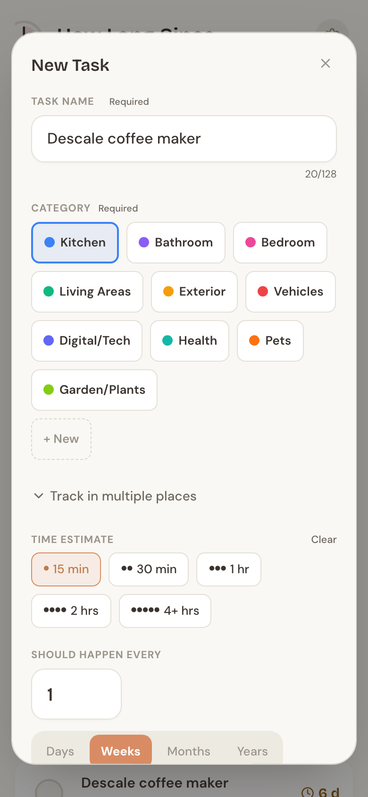

Tap the round **+** button (the terracotta circle in the bottom corner) to open
the New Task form. Only two things are required:

- **Task name** — what needs doing, like “Descale coffee maker.” Up to 128
  characters.
- **Category** — pick one of the colored pills, or tap **+ New** to create your
  own on the spot.

Everything else is optional, and each option earns its keep:

- **Time estimate** — roughly how long the task takes: 15 min, 30 min, 1 hr,
  2 hrs, or 4+ hrs. This powers the Quick Wins and By Time views, so it’s worth
  setting.
- **Should happen every** — a number plus Days, Weeks, Months, or Years. This is
  what lets the app flag a task as due soon or overdue. Leave it blank and the
  task is never overdue — the app just tracks how long it’s been.
- **Last done** — Today, Yesterday, or Pick date. Already did it a while ago?
  Backfill the real date so the count starts from the right place. The default is
  “Not done yet.”

Need to jot down more? Open **Add details** for a description and private notes.
When you’re happy, tap **Save task**.

## Track one job in many places

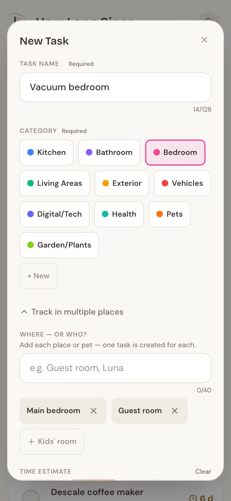

Some jobs happen in more than one spot — vacuuming three bedrooms, watering
plants in two rooms, or the same care routine for two pets. Instead of adding
the same task over and over, open **Track in multiple places** while creating a
task.

Type each place or name — “Main bedroom,” “Guest room,” “Luna” — and press Enter
or comma to turn it into a chip. If you’ve used labels in this category before,
they show up as dashed suggestions you can tap to reuse.

When you save, How Long Since creates **one task per place**, all sharing the
same name. From then on they’re independent: completing “Guest room” doesn’t
touch “Main bedroom,” and editing one never changes the others. In the By
Category and By Time views they tuck neatly into a single group row so your list
stays tidy (more on that next).

## Three ways to see your tasks

Three tabs sit at the top of the app, and it remembers whichever one you used
last.

**Quick Wins** answers a simple question: *how much time do you have?*

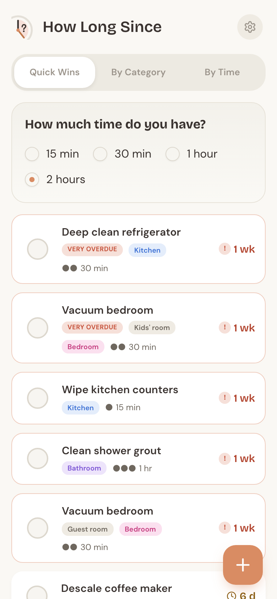

Pick 15 min, 30 min, 1 hour, or 2 hours, and the app shows the tasks that fit —
most urgent first. Only tasks with a time estimate of 2 hours or less appear
here, so it’s the place to go when you’ve got a spare pocket of time and want
something you can actually finish. It shows up to eight suggestions at a time.

**By Category** groups everything under color-dot headers — Kitchen, Bathroom,
Bedroom, and so on.

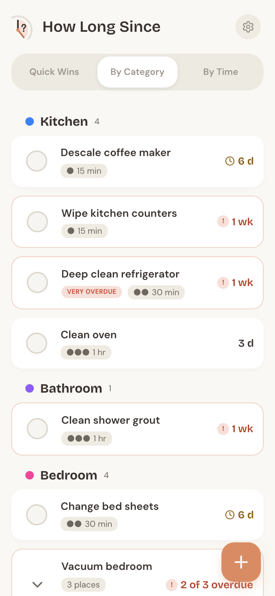

Tasks you’re tracking in multiple places collapse into one row with a
“{n} places” chip and a quick “x of n overdue” summary. Tap it to expand the
group and see each place on its own card:

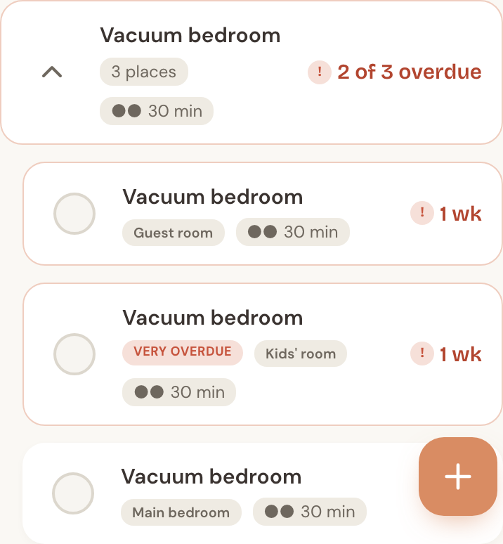

**By Time** sorts by how long tasks take — Quick tasks (15 min), Short tasks
(30 min), Medium tasks (1 hr), Longer tasks (2 hrs), Big projects (4+ hrs), and a
“No time set” group at the end.

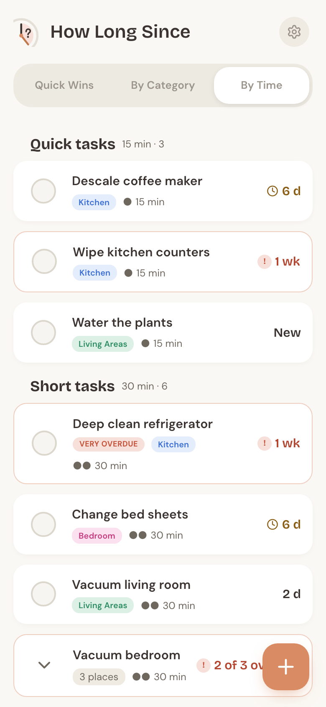

Each card carries a small tinted tag showing its category, so you never lose
track of what belongs where.

## Mark it done (and undo)

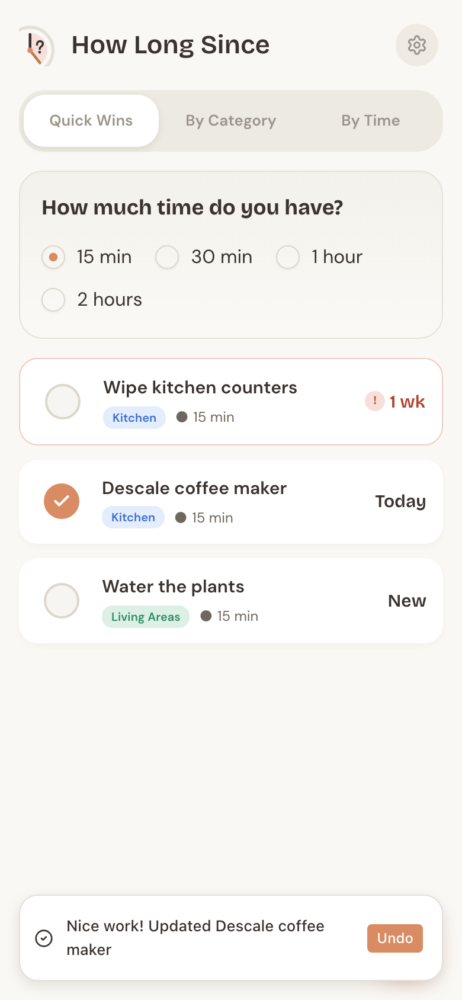

When you finish a task, tap the circle on the left of its row. That’s it — the
app records the moment and resets the clock. You’ll see a brief **“Nice work!”**
message with an **Undo** button.

Tapped the wrong row? Undo within five seconds and the task snaps back to exactly
where it was, including its previous date. No harm done.

Each row also shows how long it’s been at a glance: **New** (never done),
**Today**, **Yest.**, or a compact count like **6 d**, **1 wk**, **3 mo**, or
**2 yr**.

## Overdue, without the guilt

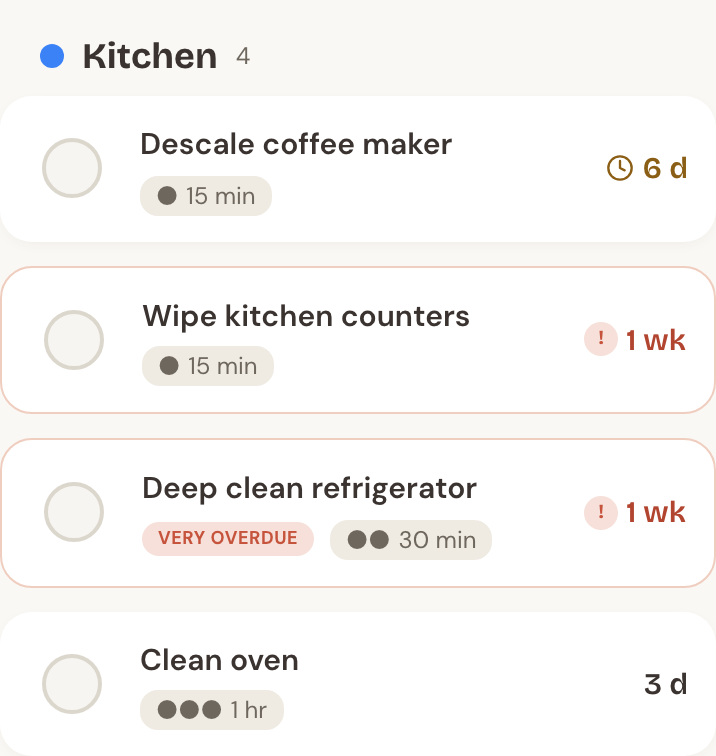

A task can be flagged only when it has **both** an expected frequency and a
last-done date. Given those, How Long Since compares how much of the interval has
passed:

- **Due soon** — you’re at 80% or more of the interval. A small clock icon
  appears.
- **Overdue** — the full interval has passed. The card gets a soft red border and
  a red “!” badge.
- **Very overdue** — half again past the interval (150%+). It adds a clear
  “Very overdue” label.

Because the flag scales with each task’s own rhythm, a daily task and a yearly
task are judged fairly — not against a fixed number of days. A task marked
**New** has never been completed, so it’s never overdue, no matter how long ago
you added it. And the wording stays factual throughout: these are signals, not
judgments.

## Edit, archive, or delete

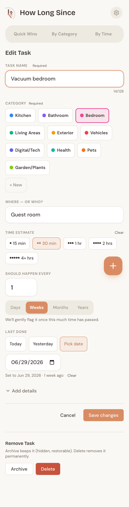

Tap any task’s name to open its edit page. You can change anything — name,
category, time estimate, frequency, last-done date, the place label, and the
details. Tap **Save changes** when you’re done.

At the bottom is a **Remove Task** area with two choices:

- **Archive** hides the task from every view but keeps it in your data. Use this
  for something you’ve stopped doing but might pick up again. Note: this version
  has no in-app “un-archive” button yet — an archived task stays in your backups,
  so restoring a backup that still contains it brings it back.
- **Delete** removes the task permanently, after a quick confirmation. This one
  can’t be undone.

## Organize with categories

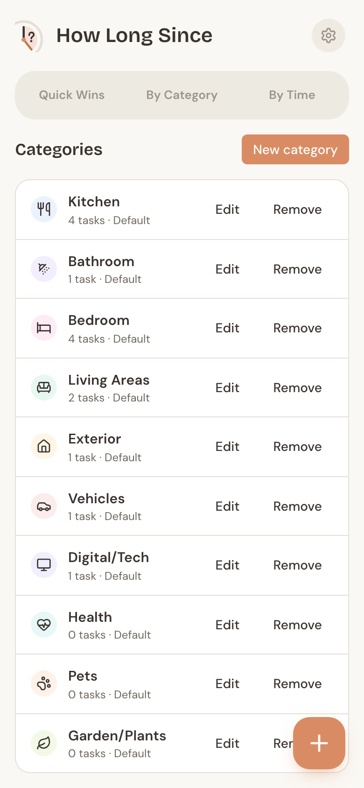

How Long Since starts you with ten categories — Kitchen, Bathroom, Bedroom,
Living Areas, Exterior, Vehicles, Digital/Tech, Health, Pets, and Garden/Plants.
You can reach **Manage Categories** from Settings or the footer of the By
Category view.

From there you can rename any category, change its color (12 to choose from) or
icon (15 options plus “None”), and add categories of your own. Deleting follows a
few sensible rules:

- An **empty** category deletes after a quick confirm.
- A category **with tasks** asks you to reassign those tasks to another category
  first.
- A **default** category that still has tasks can’t be deleted — edit it instead.

## Make it yours (Settings)

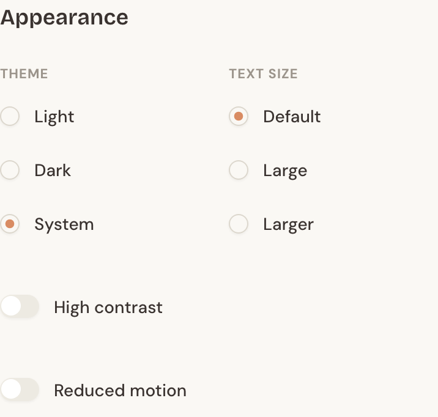

Open Settings from the gear icon in the header. Under **Appearance** you can:

- Switch between **Light**, **Dark**, and **System** themes.
- Bump the **text size** up to Large or Larger.
- Turn on **High contrast** for stronger borders and text.
- Turn on **Reduced motion** to calm animations.

You can also set your **default view** — the tab the app opens to. Under
**Notifications**, you’ll see why reminders live inside the app: your data stays
on your device with no account, so there are no phone or email alerts to turn on
yet. Phone notifications may come in a later release, alongside optional cloud
sync.

## Back up and restore

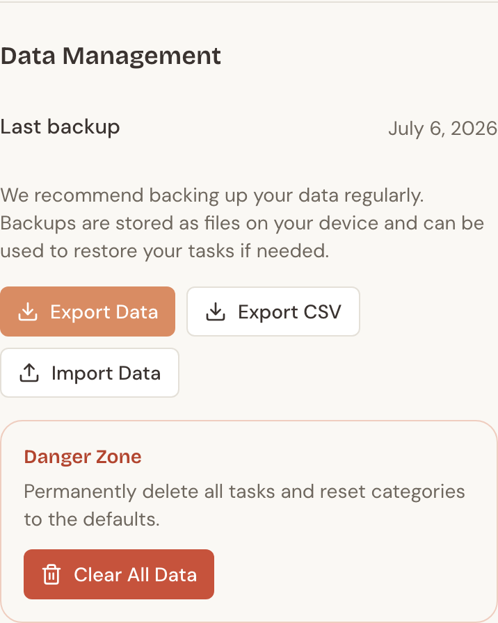

Because your data lives only on your device, backups matter. In Settings under
**Data Management**:

- **Export Data** saves a complete JSON backup file. This is the full,
  restorable copy of everything, and it stamps the “Last backup” date.
- **Export CSV** saves a tasks-only spreadsheet — handy for viewing your tasks
  elsewhere, though it isn’t used for restoring.
- **Import Data** restores from a JSON backup. Importing **replaces everything**
  currently in the app, so it asks you to confirm first.

If it’s been more than two weeks since your last backup, a gentle reminder banner
appears. And in the Danger Zone, **Clear All Data** wipes your tasks and resets
the categories to the ten defaults — useful for starting fresh, but there’s no
undo, so export first.

## Install it and use it offline

How Long Since is a Progressive Web App, which means you can install it like a
regular app straight from your browser — look for **Add to Home Screen** or an
**Install** option. Once installed, it runs full-screen and works completely
offline, since all your data is already on your device. Updates arrive quietly in
the background, so you’re always on the latest version without doing anything.

## FAQ

**How does the app decide something is overdue?**
It compares the time since you last completed a task against the frequency you
set. Past 80% of that interval, it’s “due soon”; past 100%, “overdue”; past 150%,
“very overdue.” A task needs both a frequency and a last-done date to be flagged
at all.

**Can I share my tasks with my household?**
Not yet — sharing and syncing between devices are planned for a later release.
For now, you can move your data between devices with Export Data and Import Data.

**How do I back up my data?**
Go to Settings → Data Management → Export Data. Keep that JSON file somewhere
safe; it’s the only file that can fully restore your tasks.

**What happens if I clear my browser data?**
Because everything is stored in your browser, clearing site data (or using Clear
All Data) removes your tasks. That’s exactly why regular backups are worth the
few seconds — an exported JSON file lets you restore everything.
