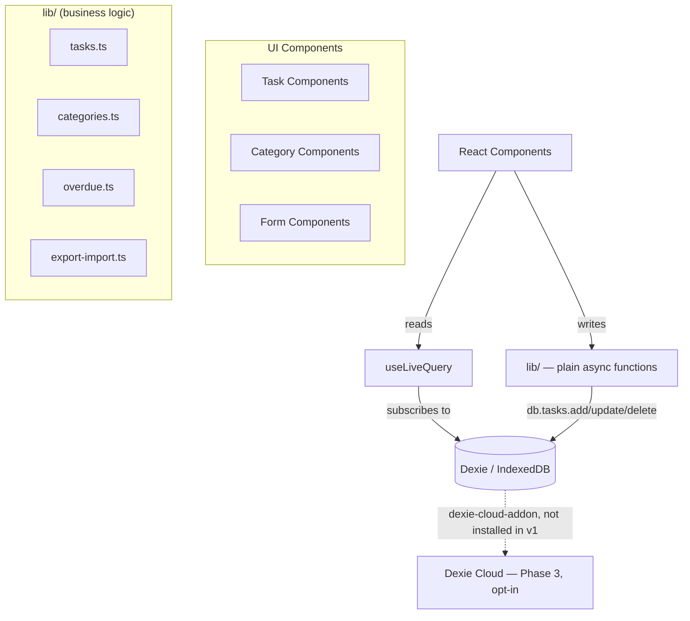

# How Long Since App - Design Document

> **Confirmed architecture, locked in June 2026.** This app is client-only
> with no account in v1, but the roadmap's Phase 3 is cloud sync + shared
> households — this design has a concrete, low-effort answer for that (Dexie
> Cloud, see the last section below), which is a large part of why this stack
> was chosen.

## Overview

A mobile-first, accessibility-compliant task tracker that answers "how long
has it been since...?" rather than managing due dates, built local-first so
it works fully offline with no account required to start. This document
covers the confirmed Vite + Dexie implementation of that product.

## Architecture

### High-Level Architecture



There's no separate "service layer" or "database abstraction layer." Dexie's
table API already *is* the data-access layer — no raw IndexedDB calls to
wrap — and `useLiveQuery` already *is* the reactive query layer, so there's no
custom `useTasks` hook needed to re-derive what Dexie gives for free. What's
left to write by hand is genuinely business logic: validation, overdue
calculation, CSV/JSON import-export — plain functions in `lib/`, not classes
wrapping every call in a `Promise<APIResponse<T>>` envelope. That kind of
envelope exists to mimic a future REST API; without a REST API to mirror —
because Dexie Cloud, not a hand-built backend, is the Phase 3 path — there's
nothing for it to prepare for.

### Folder Structure

See [`structure.md`](structure.md) for the full layout.

## Components and Interfaces

### Core Data Models

As defined in `AGENTS.md`:

```typescript
interface Task {
  id: string;
  name: string;                    // 128 char max
  description: string;             // 512 char max
  categoryId: string;
  createdAt: Date;
  lastCompletedAt: Date | null;
  expectedFrequency?: { value: number; unit: 'day' | 'week' | 'month' | 'year' };
  timeCommitment?: '15min' | '30min' | '1hr' | '2hrs' | '4hrs' | '5hrs+';
  isArchived: boolean;
  notes: string;                   // 512 char max
}

interface Category {
  id: string;
  name: string;
  color?: string;
  icon?: string;
  isDefault: boolean;
}

interface AppSettings {
  id: string;                      // singleton row, always '1'
  lastBackupDate: Date | null;
  currentView: 'category' | 'time';
  theme: 'light' | 'dark' | 'system';
  textSize?: 'default' | 'large' | 'larger';
  highContrast?: boolean;
  reducedMotion?: boolean;
}
```

### Dexie Schema

```typescript
// lib/db/schema.ts
import Dexie, { type EntityTable } from 'dexie';
import type { Task, Category, AppSettings } from '@/types';

export class HowLongSinceDB extends Dexie {
  tasks!: EntityTable<Task, 'id'>;
  categories!: EntityTable<Category, 'id'>;
  settings!: EntityTable<AppSettings, 'id'>;

  constructor() {
    super('HowLongSinceDB');

    this.version(1).stores({
      tasks: 'id, categoryId, lastCompletedAt, isArchived',
      categories: 'id, isDefault',
      settings: 'id',
    });

    // --- Phase 3, not enabled in v1 — see "Turning on sync" below ---
    // super('HowLongSinceDB', { addons: [dexieCloud] });
    // this.cloud.configure({ databaseUrl: 'https://xxxxx.dexie.cloud' });
  }
}

export const db = new HowLongSinceDB();
```

### Business Logic — Plain Functions, Not Service Classes

```typescript
// lib/tasks.ts
import { db } from './db/schema';
import { taskSchema, createTaskSchema } from '@/schemas/task';
import type { Task } from '@/types';

export async function createTask(input: unknown): Promise<Task> {
  const data = createTaskSchema.parse(input); // throws ZodError on invalid input
  const task: Task = {
    ...data,
    id: crypto.randomUUID(),
    createdAt: new Date(),
    lastCompletedAt: null,
    isArchived: false,
  };
  await db.tasks.add(task);
  return task;
}

export async function markTaskComplete(id: string): Promise<void> {
  await db.tasks.update(id, { lastCompletedAt: new Date() });
}

export async function archiveTask(id: string): Promise<void> {
  await db.tasks.update(id, { isArchived: true });
}

export async function deleteTask(id: string): Promise<void> {
  await db.tasks.delete(id);
}
```

Errors are real thrown `Error`/`ZodError` objects, not a hand-formatted
`{ status: 'error', message }` envelope — React error boundaries and a thin
try/catch at the call site handle them, the same as any other async call in a
client-only app with no API boundary to normalize across.

### Overdue Status — Three Tiers

`docs/requirements.md` Req 2.6–2.9 defines three tiers based on percentage of
the expected interval elapsed since `lastCompletedAt` (canonical thresholds in
`AGENTS.md`). A task with no `expectedFrequency`, or with `expectedFrequency`
but no `lastCompletedAt` yet, is never overdue:

```typescript
// lib/overdue.ts
import type { Task } from '@/types';

export type OverdueStatus = 'none' | 'due-soon' | 'overdue' | 'very-overdue';

const UNIT_MS = { day: 864e5, week: 6048e5, month: 2592e6, year: 31536e6 };

export function calculateOverdueStatus(task: Task, now = new Date()): OverdueStatus {
  if (!task.expectedFrequency || !task.lastCompletedAt) return 'none';

  const intervalMs = task.expectedFrequency.value * UNIT_MS[task.expectedFrequency.unit];
  const elapsedMs = now.getTime() - task.lastCompletedAt.getTime();
  const pctElapsed = elapsedMs / intervalMs;

  if (pctElapsed < 0.8) return 'none';
  if (pctElapsed < 1) return 'due-soon';
  if (pctElapsed < 1.5) return 'overdue';
  return 'very-overdue';
}
```

A pure function, not a class method — trivially unit-testable with plain
`Task` fixtures and a fixed `now`, no Dexie or mocking involved.

### Reactive Reads — `useLiveQuery`

```tsx
// components/task/TaskList.tsx
import { useLiveQuery } from 'dexie-react-hooks';
import { db } from '@/lib/db/schema';
import { markTaskComplete } from '@/lib/tasks';

export function TaskList({ categoryId }: { categoryId?: string }) {
  const tasks = useLiveQuery(
    () => (categoryId
      ? db.tasks.where('categoryId').equals(categoryId).and(t => !t.isArchived).toArray()
      : db.tasks.where('isArchived').equals(0).toArray()),
    [categoryId],
  );

  if (tasks === undefined) return <TaskListSkeleton />;

  return (
    <div className="space-y-4">
      {tasks.map(task => (
        <TaskCard key={task.id} task={task} onComplete={() => markTaskComplete(task.id)} />
      ))}
    </div>
  );
}
```

`tasks` is `undefined` while the first query resolves and automatically re-renders
whenever the underlying data changes — including changes made by *other* browser
tabs, and (once Phase 3 is on) changes synced in from another device. No `loading`/
`error`/`data` state to wire up by hand, no manual `refetch()` after a mutation.

### Validation — Zod v4

```typescript
// schemas/task.ts
import { z } from 'zod';

export const taskSchema = z.object({
  id: z.uuid(),
  name: z.string().min(1).max(128),
  description: z.string().max(512),
  categoryId: z.uuid(),
  createdAt: z.date(),
  lastCompletedAt: z.date().nullable(),
  expectedFrequency: z.object({
    value: z.number().positive(),
    unit: z.enum(['day', 'week', 'month', 'year']),
  }).optional(),
  timeCommitment: z.enum(['15min', '30min', '1hr', '2hrs', '4hrs', '5hrs+']).optional(),
  isArchived: z.boolean(),
  notes: z.string().max(512),
});

export const createTaskSchema = taskSchema.omit({
  id: true, createdAt: true, lastCompletedAt: true, isArchived: true,
});
```

Note the top-level validators (`z.uuid()`, `z.date()`) — Zod v4's API moved
string format validators off the `.string()` chain (`z.string().uuid()` in v3
became `z.uuid()`).

### Client (UI-only) State — Zustand

Only for state that has no business being in the database — modal/drawer open,
undo-snackbar visibility, that kind of thing. Task and category *data* always comes
from `useLiveQuery`; Zustand never duplicates it.

```typescript
// stores/ui-store.ts
import { create } from 'zustand';

interface UIState {
  isAddTaskOpen: boolean;
  openAddTask: () => void;
  closeAddTask: () => void;
  undoSnackbar: { taskId: string; previousState: Partial<Task> } | null;
  showUndo: (taskId: string, previousState: Partial<Task>) => void;
  dismissUndo: () => void;
}

export const useUIStore = create<UIState>((set) => ({
  isAddTaskOpen: false,
  openAddTask: () => set({ isAddTaskOpen: true }),
  closeAddTask: () => set({ isAddTaskOpen: false }),
  undoSnackbar: null,
  showUndo: (taskId, previousState) => set({ undoSnackbar: { taskId, previousState } }),
  dismissUndo: () => set({ undoSnackbar: null }),
}));
```

`currentView`/`theme`/`textSize`/etc. stay in the `settings` Dexie table (per
`AppSettings` above) rather than moving to Zustand — that keeps one source of
truth for anything that should eventually travel with the user across devices
under Dexie Cloud, instead of splitting persisted state across two stores.

## Data Validation & Error Handling

Standard validation rules (character limits, required fields), enforced by
the Zod schemas above at the `lib/` function boundary — the one place writes happen.
Storage errors (quota exceeded, etc.) surface as thrown errors from Dexie and are
caught at the call site (e.g., the form's submit handler) to show an inline message;
there's no `APIResponse` envelope to translate them into, since there's no API.

## Testing Strategy

```typescript
// lib/tasks.test.ts (Vitest)
import { describe, it, expect, beforeEach } from 'vitest';
import 'fake-indexeddb/auto';
import { createTask, markTaskComplete } from './tasks';
import { db } from './db/schema';

describe('tasks', () => {
  beforeEach(async () => { await db.tasks.clear(); });

  it('creates a task with valid data', async () => {
    const task = await createTask({ name: 'Water plants', categoryId: 'garden' });
    expect(task.name).toBe('Water plants');
    expect(task.lastCompletedAt).toBeNull();
  });

  it('rejects a task name over 128 characters', async () => {
    await expect(createTask({ name: 'x'.repeat(129), categoryId: 'garden' }))
      .rejects.toThrow();
  });
});
```

`fake-indexeddb` gives Dexie a real (in-memory) IndexedDB implementation under
Vitest's Node environment — no mocking of a custom DB-abstraction class required,
because there isn't one to mock.

Component tests (React Testing Library) and accessibility tests (`vitest-axe`)
follow the standard testing pyramid: unit-heavy on `lib/`, integration tests for full
create→complete→archive flows, Playwright for true end-to-end / offline-mode checks.

## User Interface

Same visual design system, color tokens, and content tone as
`docs/style-guide.md` and `docs/content-strategy-guide.md` — those are
stack-agnostic and unaffected by the architecture. Implementation is via
Tailwind v4's CSS-first theme tokens:

```css
/* styles/globals.css */
@import "tailwindcss";

@theme {
  --color-primary: #2563eb;
  --color-overdue: #dc2626;
  --color-success: #10b981;
  --color-text: #1f2937;
  --color-text-muted: #6b7280;

  --color-category-kitchen: #3b82f6;
  --color-category-bathroom: #8b5cf6;
  --color-category-bedroom: #ec4899;
  --color-category-living: #10b981;
  --color-category-exterior: #f59e0b;
  --color-category-vehicles: #ef4444;
  --color-category-digital-tech: #6366f1;
  --color-category-health: #14b8a6;
  --color-category-pets: #f97316;
  --color-category-garden-plants: #84cc16;

  --color-warning: #f59e0b;

  --radius-card: 0.5rem;
}
```

Tailwind v4 reads theme tokens straight from CSS (`@theme`) — no separate
`tailwind.config.js`. shadcn/ui components are added via `npx shadcn@latest
add <component>` and live in `components/ui/` as plain, owned `.tsx` files —
copied into the repo, not installed as a dependency.

## Accessibility Implementation

WCAG 2.1 AA, 44px touch targets, non-color status indicators, keyboard
navigation, `aria-live` announcements for state changes. shadcn's components
are built on Radix UI primitives, which carry these accessibility guarantees
by default.

## PWA / Offline

```typescript
// vite.config.ts
import { defineConfig } from 'vite';
import react from '@vitejs/plugin-react';
import { VitePWA } from 'vite-plugin-pwa';

export default defineConfig({
  plugins: [
    react(),
    VitePWA({
      registerType: 'autoUpdate',
      manifest: {
        name: 'How Long Since',
        short_name: 'HowLongSince',
        theme_color: '#2563eb',
        icons: [
          { src: 'pwa-192x192.png', sizes: '192x192', type: 'image/png' },
          { src: 'pwa-512x512.png', sizes: '512x512', type: 'image/png' },
        ],
      },
    }),
  ],
});
```

This is the entire offline setup for v1 — no hand-written Service Worker, no
separate PWA plugin configuration to reverse-engineer. Because all data
already lives in IndexedDB and there's no network call on the read/write
path, "offline support" here mostly means "cache the app shell" — which is
exactly what `vite-plugin-pwa`'s default Workbox config does. Push
notifications (overdue reminders, the 2-week backup reminder) are explicitly
out of scope for v1 — see `docs/content-strategy-guide.md`, which tags
Notifications as a future feature; the backup reminder ships as an in-app
banner instead.

## Phase 3: Turning On Sync

When (and if) "Phase 3: Cloud & Community" actually gets scoped:

```bash
npm install dexie-cloud-addon
```

```typescript
// lib/db/schema.ts — the only file that changes
import dexieCloud from 'dexie-cloud-addon';

export class HowLongSinceDB extends Dexie {
  // ...same table declarations...

  constructor() {
    super('HowLongSinceDB', { addons: [dexieCloud] });

    this.version(1).stores({
      tasks: '@id, categoryId, lastCompletedAt, isArchived, realmId',
      categories: '@id, isDefault, realmId',
      settings: '@id',
    });

    this.cloud.configure({ databaseUrl: 'https://xxxxx.dexie.cloud' });
  }
}
```

No component changes — `useLiveQuery` calls keep working unmodified, because Dexie
Cloud syncs the same local tables those queries already read from. Accounts, login,
and multi-device sync come from `dexie-cloud-addon` directly. "Shared households"
maps onto Dexie Cloud's **realms**: a household creates a shared realm, invites
members by email, and every task/category tagged with that realm syncs to everyone
in it — which is what the roadmap's "shared households" line item actually needs.

**The honest tradeoff**: Dexie Cloud is a hosted SaaS (a few free seats while
evaluating, then paid 25-seat packs) — a recurring vendor dependency a fully
self-hosted backend wouldn't have, in exchange for not having to design,
build, and operate that backend at all. v1 doesn't install
`dexie-cloud-addon` and has zero cloud dependency either way — this is a
decision to make *when* Phase 3 is real work, not a v1 commitment. It's
documented here because it changes how today's data layer should be chosen,
not because it needs deciding today.
